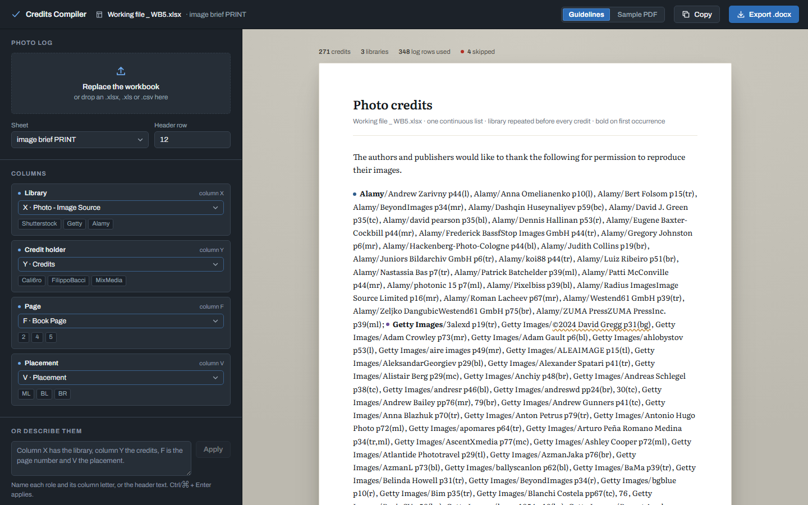

# Credits Compiler documentation

Credits Compiler turns a photo-log spreadsheet into a photo credit page that follows the
house rules, and exports it as `.docx`.

## Pick your page

| If you want to… | Read |
| --- | --- |
| Make a credit page from a photo log | [User guide](user-guide.md) |
| Know exactly how each credit gets formatted, and why | [Credit formatting rules](credit-rules.md) |
| Put the app on Vercel or build the desktop app | [Deployment](deployment.md) |
| Change the code — add a library, a rule, a column | [Developer guide](developer-guide.md) |
| Fix something that looks wrong | [Troubleshooting](troubleshooting.md) |

## Source documents

The rules come from two client documents. They are confidential, so they are **not in the
repository** — `.gitignore` excludes every `.docx`, `.pdf` and spreadsheet. Keep your copies
in the project root. Where these docs and the documents disagree, the documents win and the
docs are the bug.

- `00 Media Research Guidelines.docx`, Photo Credits section
- `Credit_Page_Formatting_Instructions.docx`

`Creditos RAU_SB3-MLLP-Final.pdf` is the reference output for the **Sample PDF** style.
`Working file _ WB5.xlsx` is the sample photo log every example in these docs uses.

## Elsewhere in the repo

- [`README.md`](../README.md) — quick start
- [`PRODUCT.md`](../PRODUCT.md) — who the product is for and what it must never do
- [`DESIGN.md`](../DESIGN.md) — the visual system: colour, type, components, layout
