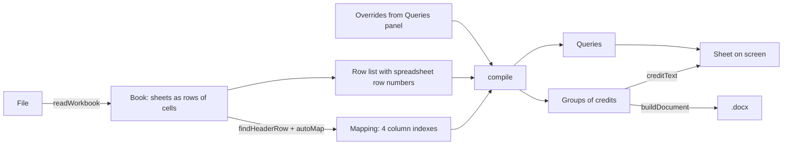

# Developer guide

## Stack

| Part | Choice | Why |
| --- | --- | --- |
| UI | React 18, TypeScript, Vite 6 | a small single-screen tool; Vite is Tauri's default |
| Spreadsheets | SheetJS 0.20.3 (`xlsx`) | reads xlsx, xls, csv in the browser |
| Output | `docx` 9 | builds Word files in the browser |
| Fonts | `@fontsource-variable/archivo`, `@fontsource-variable/literata` | bundled, so the desktop app works offline |
| Desktop | Tauri 2 | wraps the static build in a native window |
| Tests | `node:assert` run by `tsx` | no test framework needed for pure functions |

There is no backend, database or saved state. Everything happens in the page.

## Run it

```bash
npm install
npm run dev      # http://localhost:5173
npm test         # the credit rules
npm run build    # type-check and build to dist/
```

## Files

```
src/
  credits.ts        every credit-page rule; pure functions, no DOM
  credits.test.ts   checks for credits.ts
  sheet.ts          reading the workbook, finding the header row
  docx.ts           building the .docx for both styles
  App.tsx           the interface and its state
  main.tsx          mount point, font imports
  styles.css        all styles and design tokens
index.html          page shell; carries the design direction comment
src-tauri/          desktop shell
vercel.json         Vercel build settings
```

## How data flows



1. **`readWorkbook(file)`** (`sheet.ts`) turns every sheet into an array of rows of raw cell
   values.
2. **`findHeaderRow(rows)`** tries each of the first 40 rows as headers and keeps the one
   `autoMap` can map most roles from.
3. **`autoMap(headers)`** (`credits.ts`) chooses a column for each role by matching header
   text, most specific pattern first.
4. **`compile(rows, mapping, overrides)`** returns library groups, each holding sorted
   credits, plus the list of queries and the used and skipped counts.
5. The screen and **`buildDocument`** (`docx.ts`) both format those groups with
   **`creditText`** and **`reference`**, so the page and the file cannot disagree.

`App.tsx` keeps the file, sheet, header row, mapping, overrides and style in state. The
compiled result is derived with `useMemo` whenever any of them change.

### Key types

```ts
type Mapping = { library: number | null; credit: number | null; page: number | null; placement: number | null };

type Credit = {
  library: string;             // house name, e.g. "Getty Images"
  name: string;                // as written in the log, spacing cleaned
  sortKey: string;
  pages: Map<string, string[]>; // page -> position codes in reading order
  rows: number[];              // spreadsheet row numbers, for tracing
};

type Query = {
  kind: 'library' | 'no-library' | 'placement' | 'page' | 'credit';
  value: string;
  note: string;
  rows: number[];
};
```

Row numbers in `Credit.rows` and `Query.rows` are the numbers you see in Excel. `App.tsx`
sets them as array index + 1.

### Overrides

A library set in the Queries panel is stored in `overrides`, a plain object passed to
`compile`:

- an **unrecognised library** is keyed by its lowercased spelling: `{ pixabay: 'Alamy' }`;
- a **credit with no library** is keyed by its credit holder via `byCreditKey(name)`,
  which adds an `@` prefix: `{ '@magone': 'Getty' }`.

The override value then goes through the alias table like any library cell. Overrides
reset when a new file loads.

## Common changes

### Add a library spelling

Add a line to `LIBRARY_ALIASES` in `credits.ts`. Keys are lowercase with no trailing
punctuation:

```ts
export const LIBRARY_ALIASES: Record<string, string> = {
  // ...
  'science photo library': 'Science Photo Library',
  spl: 'Science Photo Library',
};
```

Add a matching assertion to `credits.test.ts`.

### Allow another position code

Add it to `POSITION_CODES` in `credits.ts`. If it needs a place in reading order, give its
first letter a band in `BAND` and its second letter a side in `SIDE`.

### Recognise another header name

Add a pattern to the role's list in `ROLE_WORDS` in `credits.ts`. Lists are tried in order
and the first match wins, so put specific patterns before general ones. This is why
`/(image|photo|picture)\s*-?\s*(source|librar|agenc)/` comes before `/\bsource\b/`: WB5
also has a *Source Doc* column.

For the sentence parser, add the word to `PROMPT_ROLES` as well.

### Change the opening sentence

Edit `INTRO` in `credits.ts`. The screen, the clipboard text and the `.docx` all read it.

### Change the `.docx` layout

Edit `buildDocument` in `docx.ts`. Sizes are in half-points, so `size: 22` is 11pt.

### Add a third output style

1. Add the name to `type Style` in `credits.ts`.
2. Handle it in `reference`, `creditText` and `toText`.
3. Add a branch to `buildDocument` in `docx.ts`.
4. Add a button to the segmented switch and a render branch in `App.tsx`.
5. Add the expected output to `credits.test.ts`.

## Testing

`npm test` runs `src/credits.test.ts`. It uses plain `assert` and stops at the first
failure. It covers:

- CPFI's worked example in both styles
- `p` / `pp` and combined positions
- collapsing repeated rows while keeping every row number
- each kind of query, and resolving them with overrides
- case- and punctuation-insensitive sorting
- `autoMap` against WB5's real header row
- the sentence parser, including an out-of-range column letter

Any change to `credits.ts` should come with an assertion here.

The interface has no automated tests. Before a release, load `Working file _ WB5.xlsx` and
check it still reports **271 credits, 3 libraries, 348 log rows used, 4 skipped** and six
queries. To script that in a browser, copy the workbook to `public/sample.xlsx` (ignored by
git) so the dev server can fetch it.

## Design

Colours, type and components are documented in [`DESIGN.md`](../DESIGN.md), and the tokens
are the custom properties at the top of `src/styles.css`. Two constraints worth keeping:

- State colours (blue, red, green, amber) only ever mean state. Library swatches use a
  separate palette.
- Card state is shown on the control and with a dot, never with a coloured left border.
