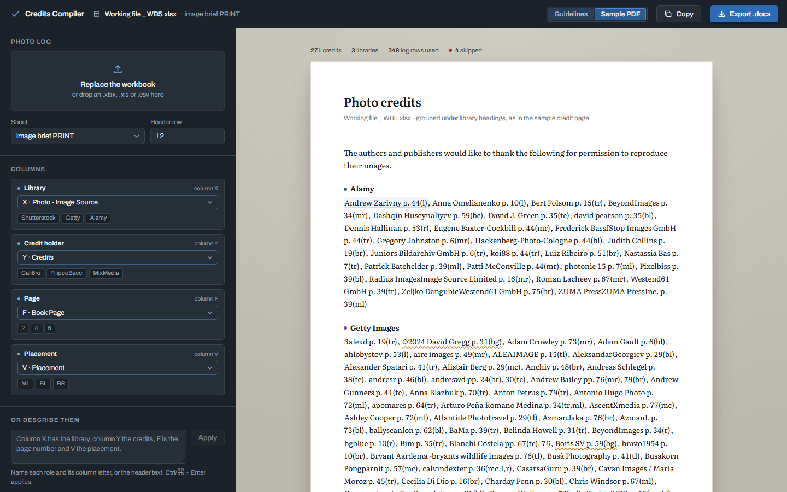
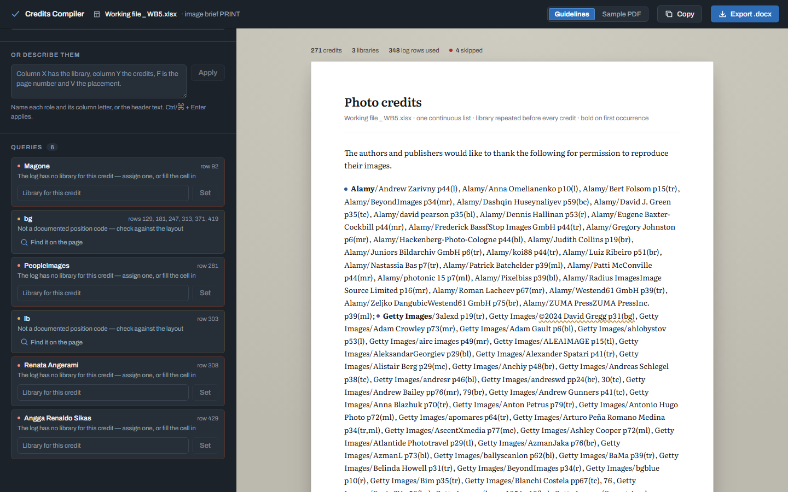

# User guide

This guide walks through making a credit page from a photo log. The examples use
`Working file _ WB5.xlsx`, the Workbook 5 photo log. It is a client file and is not
committed to the repository.

Nothing you load leaves your computer. The spreadsheet is read inside the app window and
the `.docx` is built there as well, on the website and on the desktop app alike.

## 1. Load the photo log

Click **Choose the photo log**, or drop the file anywhere on the window.

Accepted: `.xlsx`, `.xlsm`, `.xls`, `.csv`, `.tsv`.

The app then works three things out for itself:

- **Which sheet.** It reads every sheet and opens the one whose headers match the four
  columns best. For WB5 that is `image brief PRINT`.
- **Which row holds the headers.** Photo logs have a legend block above the real headers.
  The app looks through the first 40 rows and picks the one that reads most like a header
  row. For WB5 that is row 12.
- **Which columns to use.** See the next step.

If it picked the wrong sheet, choose another from **Sheet**. If it picked the wrong header
row, type the right row number into **Header row**. Changing either one maps the columns
again from scratch.

## 2. Check the columns

The **Columns** panel has one card per role:

| Role | Needed? | What it becomes | WB5 column |
| --- | --- | --- | --- |
| Library | Yes | the name before the slash, e.g. `Getty Images` | X · Photo - Image Source |
| Credit holder | Yes | the name after the slash | Y · Credits |
| Page | No | `p7`, `pp10, 11` | F · Book Page |
| Placement | No | `(tr)`, `(bl)` | V · Placement |

Each card shows a few real values from the column underneath its dropdown, so you can see
at a glance whether the column is the right one. A dot before the role name shows its
state:

- **Blue** — mapped.
- **Red** — a required role with no column. Nothing compiles until it is set.
- **Amber** — an optional role left empty. The credits compile without it.

To change a column, pick it from the dropdown. The dropdown lists every column by letter
and header text.

> **Page, not Page Number.** WB5 has two page-like columns: F *Book Page* and Z *Page
> Number*. The app picks F, because *Book Page* is the page in the final layout. Change it
> if your project uses the other.

### Or describe the columns in a sentence

Type into **Or describe them** and press **Apply** (or Ctrl + Enter). Any of these work:

```
Column X has the library, column Y the credits, F is the page number and V the placement.
library X, credits Y, page F, placement V
The placement is in column V
```

The app splits the sentence at commas, full stops and the word *and*. In each part it looks
for a role word (library, agency, source, credit, copyright, photographer, page, folio,
placement, position, location) and a column letter. If there is no letter, it looks for a
header name you mentioned instead.

After you apply, the line under the box says exactly what changed, for example
`Set library → X, placement → V`. If it could not understand the sentence, it says so and
changes nothing. It never guesses.

## 3. Read the credit page

The white sheet on the right is the credit page, built live from whatever is mapped. It
changes the moment you change a column.

Above the sheet, a status line counts the credits, libraries, log rows used, and rows
skipped because they could not be compiled.

The sheet's title reads **Photo credits**. Click it to rename it, for example to
*Workbook 5 photo credits*. The title becomes the heading of the `.docx` and its file name.

### Choose a style

The switch in the top bar sets the style. The two source documents disagree about layout,
so both are available.

**Guidelines** (default) — follows `Credit_Page_Formatting_Instructions.docx`:

> **Alamy**/Adam Brown p7(a), Alamy/Carl Pike p10(tr), Alamy/John Smith p11;
> **Getty Images**/Anne White p32(dog), Getty Images/Sarah Green p20(bl);
> **Shutterstock**/wavebreakmedia p40(br).

**Sample PDF** — matches `Creditos RAU_SB3-MLLP-Final.pdf`:

> **Alamy**
> Adam Brown p. 7(a), Carl Pike p. 10(tr), John Smith p. 11



Both styles start with the required sentence: *The authors and publishers would like to
thank the following for permission to reproduce their images.* The full rules are in
[Credit formatting rules](credit-rules.md).

### See where a credit came from

Click any credit on the sheet. The **Columns** area then shows every spreadsheet row that
produced it, with the values in each mapped column. Use this to check a credit against the
log without scrolling the spreadsheet. The back arrow closes it.

## 4. Work through the queries

The app does not fix doubtful data by guessing. Anything it is unsure of appears in the
**Queries** panel at the bottom of the rail, with the spreadsheet rows it came from.



| Query | Dot | What happened | What to do |
| --- | --- | --- | --- |
| The log has no library for this credit | Red | The row has a credit holder but the library cell is empty. It is **not** on the page. | Type the library into the box and press **Set**, or fill in the cell and reload. |
| No credit holder | Red | The row has a library but no name. It is **not** on the page. | Fill in the cell and reload. |
| Unrecognised library | Amber | The library is not a known spelling, so it is on the page exactly as typed. | Type the house name (for example `Alamy`) and press **Set**. |
| Not a documented position code | Amber | A placement such as `bg` or a description such as `dog` is not in the code table. It is on the page as written. | Check it against the approved layout. |
| No page number | Amber | The credit is on the page, but with no page reference. | Fill in the cell and reload. |

On the sheet, a credit with an open query has an **amber wavy underline**. On a long page,
press **Find it on the page** in the query card to jump straight to that credit.

A library you **Set** applies only while the file stays open. Loading a file again clears
it, so for a lasting fix, correct the spreadsheet.

### What WB5 flags

Loading `Working file _ WB5.xlsx` produces six queries:

- rows 92, 281, 308 and 429 have a credit holder and no library (`Magone`, `PeopleImages`,
  `Renata Angerami`, `Angga Renaldo Sikas`);
- `bg` is used as a placement on six rows, and `lb` on one.

Three credit names in WB5 are also missing a slash in the spreadsheet itself, for example
`Frederick BassfStop Images GmbH` on row 268. The app copies names exactly as supplied, so
this has to be fixed in the log.

## 5. Export

- **Export .docx** downloads the credit page in the style currently selected, named after
  the sheet title.
- **Copy** puts the same credit page on the clipboard as plain text, for pasting into an
  email or a layout file. Plain text has no bold.

The export is disabled until the Library and Credit holder columns are both mapped and at
least one credit compiles.

## Before you submit

The app handles alphabetising, punctuation, bold and page references. It **cannot see the
page layout**, so these checks from the formatting instructions are still yours:

- Every page number matches the final approved layout.
- Every position code matches where the image actually sits on that page.
- Every name is spelt as the photo log and supplier give it.

## On a phone or narrow window

Below about 900px wide the rail and the sheet stack. Before a file is loaded, the upload
controls come first. After it loads, the credit page comes first and the controls follow
underneath. The top bar stays pinned so Export is always within reach.
